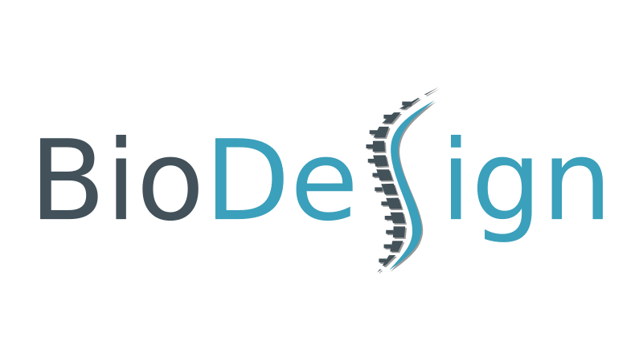

<!-- PROJECT LOGO -->

***Elbow dimensions in quadrupedal mammals driven by lubrication regime***

*Kalenia Marquez-Florez, Santiago Arroyave-Tobon, Loïc Tadrist, Jean-Marc Linares*

# ReadMe(s)
[ReadMe for DATA](DATA/ReadME.md)

[ReadMe for Codes](TaxetCalcul/ReadMe.md)

## Contact

Kalenia Marquez-Florez - kalenia-maria.marquez-florez@univ-amu.fr

Santigo Arroyave-Tobon - santiago.ARROYAVE-TOBON@univ-amu.fr

Loïc Tadrist - loic.TADRIST@univ-amu.fr

Jean-Marc Linares - jean-marc.linares@univ-amu.fr

Project Link: [https://github.com/sarroyavet/BioDesign_joint_morphogenesis](https://github.com/sarroyavet/BioDesign_joint_morphogenesis)

<!-- ACKNOWLEDGMENTS -->
## Acknowledgments

This research was supported by the French Research National Agency (Agence Nationale de la Recherche, ANR) Grant No. ANR-20-CE10-0008, through the project BioDesign.

(<a href="#readmes">back to top</a>)
