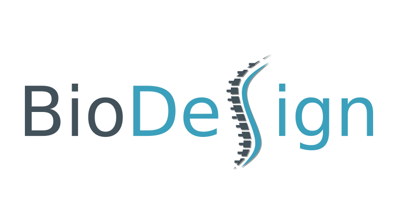

<!-- PROJECT LOGO -->


# ReadMe for TaxetCalcul folder

This folder contains the code employed within the research paper: 

***Size does not matter: allometry reveals consistent pressure and sliding velocity in quadrupedal mammalian elbow***

*Kalenia Marquez-Florez, Loïc Tadrist, Santiago Arroyave-Tobon, Jean-Marc Linares*

Aix Marseille Univ, CNRS, ISM, Marseille, France

[![LinkedIn][linkedin-shield]][linkedin-url]


<!-- TABLE OF CONTENTS -->
<details>
  <summary>Table of Contents</summary>
  <ol>
    <li><a href="#about-the-project">About The Project</a></li>
    <li><a href="#prerequisites">Prerequisites</a></li>
    <li><a href="#usage">Usage</a></li>
    <li><a href="#contact">Contact</a></li>
    <li><a href="#acknowledgments">Acknowledgments</a></li>
  </ol>
</details>

<!-- ABOUT THE PROJECT -->
## About The Project
The codes here are part of the results from the research paper: *Size does not matter: allometry reveals consistent pressure and sliding velocity in quadrupedal mammalian elbow*. This repository contains the Python and R scripts used within the project.

<!--
*** Here's a blank template to get started: To avoid retyping too much info. Do a search and replace with your text editor for the following: `github_username`, `repo_name`, `twitter_handle`, `linkedin_username`, `email_client`, `email`, `project_title`, `project_description`
-->

<p align="right">(<a href="#readme-top">back to top</a>)</p>

### Built With

* [![Python][Python.png]][Python-url]
* [![R][R.png]][R-url]

<p align="right">(<a href="#readme-top">back to top</a>)</p>

<!-- GETTING STARTED -->
## Getting Started

Assure that the following packages from <a href="#prerequisites">Prerequisites</a> of Python and R are installed before running the code. Also, be sure to have track of the location of the [".vtk" files](DATA/Distal) of the distal surface of the humeri, as well as the files [New_tax.csv](DATA/New_tax.csv) and [3DfilesDb.csv](DATA/3DfilesDb.csv), as they are the inputs for the Python script.

### Prerequisites
#### *For Python*
We developed the Python script for the version 3.6.9.

* json
  ```sh
  pip3 install json
  ```
* NumPy
  ```sh
  pip3 install numpy
  ```
* cmath
  ```sh
  pip3 install cmath
  ```
* csv
  ```sh
  pip3 install csv
  ```
* Pandas
  ```sh
  pip3 install pandas
  ```
  Be sure to previously install NumPy.

* mlxtend
  ```sh
  pip3 install mlxtend
  ```
  Be sure to previously install the external dependencies for this package, including NumPy, Pandas, Matplotlib and Scikit-learn. 

* cylinder_fitting
  ```sh
  pip3 install cylinder_fitting
  ```
  Be sure to previously install the external dependencies for this package: Numpy and SciPy.
* vtk
  ```sh
  pip3 install vtk
  ```
  Be sure to previously install the external dependencies for this package, including OpenGL, CMake, and Python development headers. For more information on installing VTK, please refer to the [VTK installation instructions](https://gitlab.kitware.com/vtk/vtk/-/blob/master/Documentation/dev/build.md).

* Matplotlib
  ```sh
  pip3 install matplotlib
  ```

  Be sure to previously install the external dependencies for this package, including NumPy, libpng, freetype, and Python development header. For more information on installing Matplotlib, please refer to the [Matplotlib installation instructions](https://matplotlib.org/stable/users/installing/index.html).

* SciPy
  ```sh
  pip3 install scipy
  ```
  Be sure to previously install the external dependencies for this package, including NumPy, BLAS, LAPACK, and CMake. For more information on installing SciPy, please refer to the [SciPy installation instructions](https://scipy.org/install/).

* ete3
  ```sh
  pip3 install ete3
  ```
  Be sure to previously install the external dependencies for this package, including NumPy, SciPy, and Matplotlib. For more information on installing ETE Toolkit, please refer to the [ETE Toolkit installation instructions](http://etetoolkit.org/download/).

#### *For R*
We developed the R script for the version 4.2.2 Patched (2022-11-10 r83330).

* ape
* caper
* dplyr
* mosaic
* phytools
* Polychrome
* reticulate
* rlang
* smatr
* viridis

To install these packages and their dependencies, you can use the following code in R:
  ```sh
  install.packages(c("ape", "caper", "dplyr", "mosaic", "phytools", "Polychrome", "reticulate", "rlang", "smatr", "viridis"))
  ```

<!-- USAGE EXAMPLES -->
## Usage

### Python script
To use this codes you should start with the python file [EspInfo.py](EspInfo.py), in that code assure that you have the correct directory for the variable `fileDir` (this variable should be the directory should contain the input files as well as the folder [Distal](/DATA/Distal) *.vtk* files of the distal humerus surfaces are). Additionally, the variables:
<!-- input files -->
#### Input Files:
* *`espfile`* -> the data of the species included in the study [New_tax.csv](DATA/New_tax.csv).
* *`D3fileDB`* ->  the data of the bones included in the study [3DfilesDb.csv](DATA/3DfilesDb.csv).

<!-- output files -->
#### Output Files:
* *`Spout`* -> an output file of the script in which the measurements are related to each species. This file is necessary for the second part which runs in R.
* *`Bonesout`* -> an output file of the script in which the measurements are related to each bone.

### R script:
This script is used to define the allometric relationships of the distal humerus. In it, you should define the input directories: `Data_Animal_csv` and `Data_Animal_pd`. These files are output files of the Python script. 

Also, you should consider modifying the variables `treesfile` (which is the location of the phylogenetic trees used in the study) and `ffile` in the different instances of the code (one where the histograms are stored and one where the plots of the phylogenetic trees are stored).

<p align="right">(<a href="#readme-top">back to top</a>)</p>

<!-- CONTACT -->
## Contact

Kalenia Marquez-Florez - kalenia-maria.marquez-florez@univ-amu.fr

Santigo Arroyave-Tobon - santiago.ARROYAVE-TOBON@univ-amu.fr

Loïc Tadrist - loic.TADRIST@univ-amu.fr

Jean-Marc Linares - jean-marc.linares@univ-amu.fr

Project Link: [https://github.com/sarroyavet/BioDesign_joint_morphogenesis](https://github.com/sarroyavet/BioDesign_joint_morphogenesis)

<p align="right">(<a href="#readme-top">back to top</a>)</p>


<!-- ACKNOWLEDGMENTS -->
## Acknowledgments

This research was supported by French Research National Agency (Agence Nationale de la Recherche, ANR) Grant No. ANR-20-CE10-0008, through the project BioDesign.

<p align="right">(<a href="#readme-top">back to top</a>)</p>


<!-- MARKDOWN LINKS & IMAGES -->
<!-- https://www.markdownguide.org/basic-syntax/#reference-style-links -->
[linkedin-shield]: https://img.shields.io/badge/-LinkedIn-black.svg?style=for-the-badge&logo=linkedin&colorB=555
[linkedin-url]: https://linkedin.com/in/kalenia-márquez-flórez-5b686064/
[Python.png]: https://img.shields.io/badge/Python-0769AD?labelColor=blue?style=plastic&logo=python&logoColor=white
[Python-url]: https://www.python.org/
[R.png]: https://img.shields.io/badge/R-0769AD?style=plastic&logo=R&logoColor=white
[R-url]: https://www.r-project.org/
